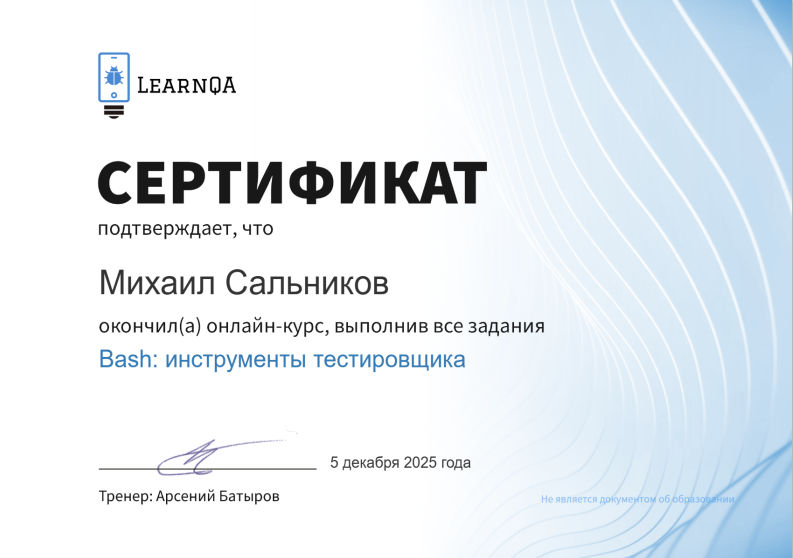
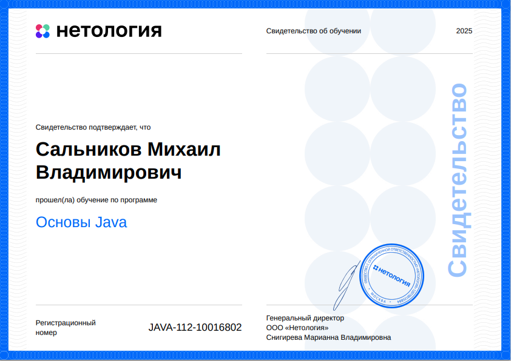
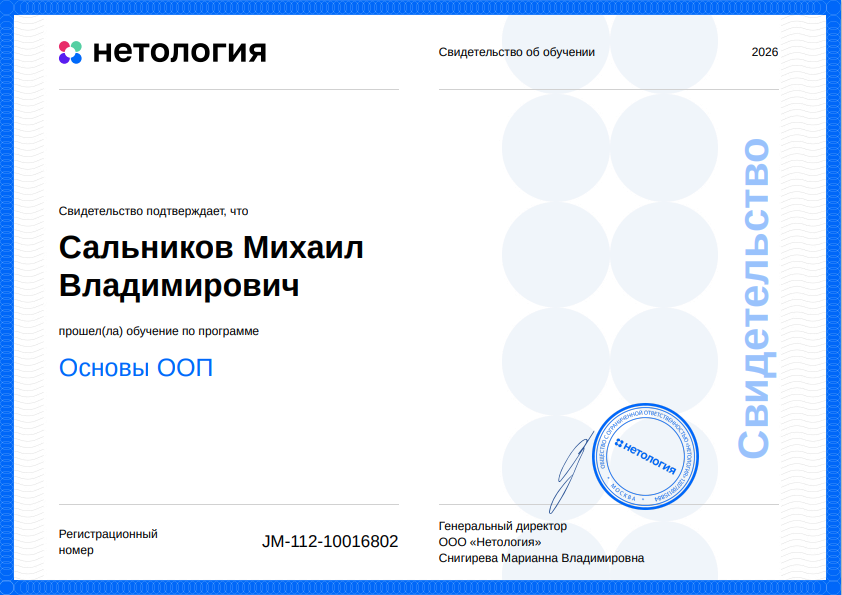
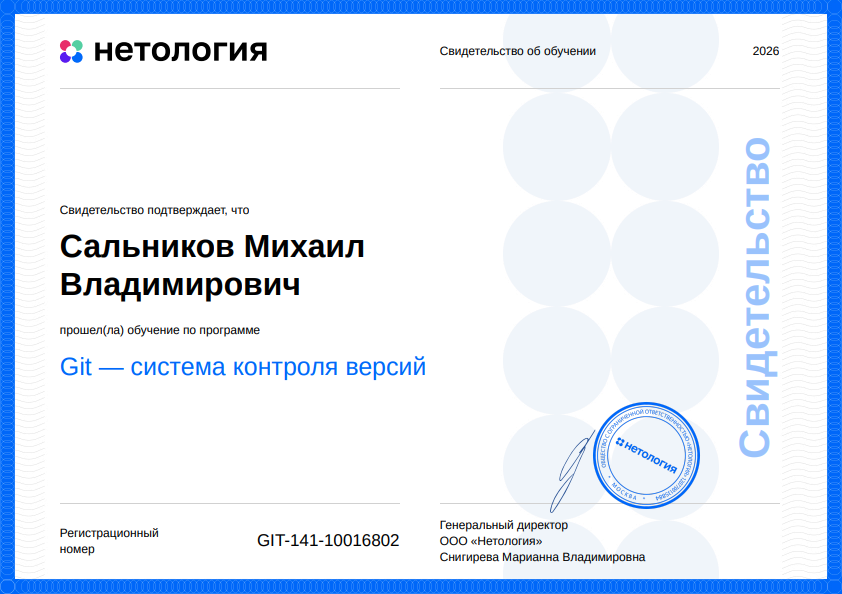

  <h1>
    
    Михаил Сальников | mrRazmarin
    
  </h1>
  
  

    
  

---

## 🚀 О себе

### **Кто я**

Я **Middle QA Fullstack Engineer** с опытом в тестировании более 3-х лет. 

Мой профессиональный путь начался с **ручного тестирования** на сложных медицинских IT-проектах, где научился вниманию к деталям и критическому мышлению. Со временем я расширил свои навыки, освоив автоматизацию, и теперь способен обеспечивать качество продукта на всех уровнях — от API до пользовательского интерфейса.

На данный момент я работаю в компании **Flowwow** (маркетплейс), где занимаюсь улучшением процессов тестирования и разработкой автотестов.

---

## 🛠 Технологический стек

Ниже представлены основные инструменты и технологии, которые я использую в своей работе.

### 🚀 Languages & Frameworks

### 🧪 Testing Tools

### 🛠️ Build Tools & IDE

---

## 💡 Избранные проекты

Здесь представлены мои наиболее значимые проекты с автоматизацией.

### 🔥 Flagship Repositories
<table>
<tr>
<td width="50%" align="center">
**🌐 API autotests**
 

 
</td>
</tr>
</table>

---

## 📊 GitHub Аналитика

---

## 📜 Сертификаты

    
    
    
    

---

## 📬 Связаться со мной

Я всегда открыт к обсуждению новых проектов, идей или возможностей стать частью вашего видения.

  
  
  

---

  <i>Сделано с ❤️ и кодом</i>

