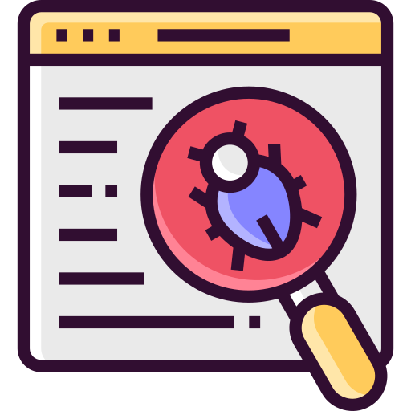
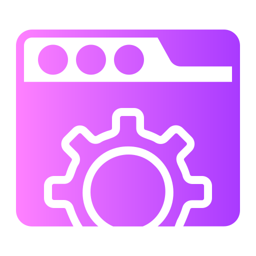
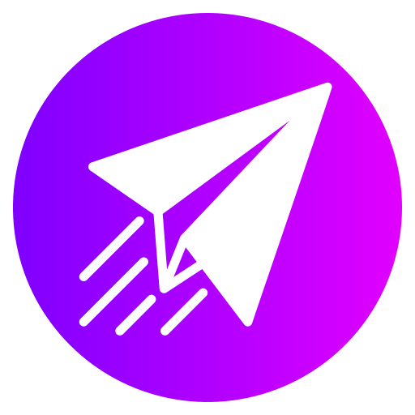

    

#  About me

### _I am a QA Engineer_ 

    I have over 2 years of experience in testing web applications and quality assurance. I regularly pursue further education in the field of testing, studying new technologies and improving my skills.

 

 

 

##  Technology stack

    
    
    
    <!-- --->
    
    <!-- --->
    
    
    
     
    <!-- --->
    
    <!-- --->
    <!-- --->
    <!-- --->
    <!-- --->
    <!-- --->

 

##  Contacts

    

 

    

    

